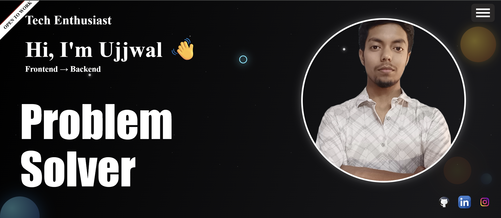
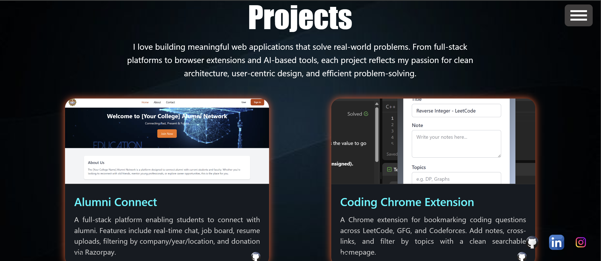
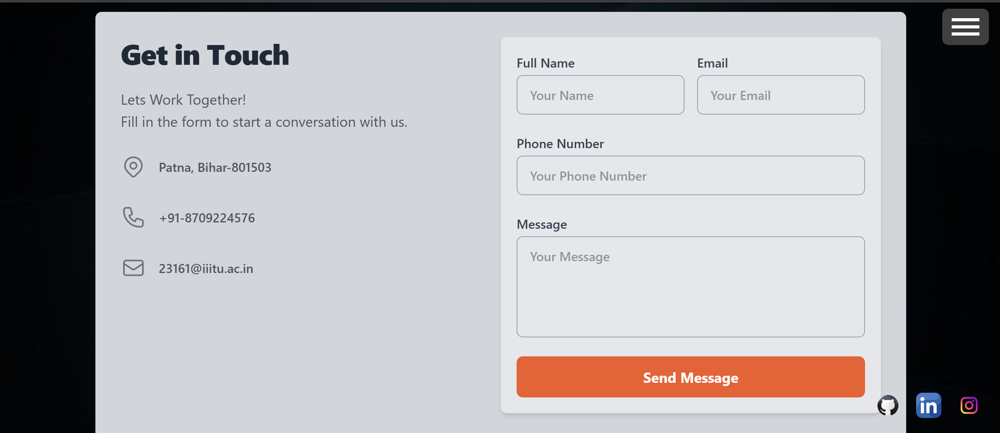

# 🌐 Ujjwal Kumar - Portfolio Website

Welcome to the source code of my personal portfolio website! This site showcases my skills, projects, and experiences as a web developer and problem solver.

## 🚀 Live Demo

👉 [View Live Portfolio](https://my-portfolio-omega-eight-53.vercel.app/)

## 🛠 Tech Stack

- **Frontend**: HTML, CSS, JavaScript, React, Tailwind CSS  
- **Animations**: Framer Motion, AOS  
- **Hosting**: Vercel / Netlify / GitHub Pages

## 📌 Features

- Responsive and clean UI
- Scroll-based animations
- Projects with GitHub/demo links
- Categorized skills section
- Contact form
- Resume download option
- SEO-friendly with meta tags

## 📸 Screenshots

### 🏠 Home Page


### 💼 Projects Section


### ✉️ Contact Section


## 🧠 How to Run Locally

```bash
git clone https://github.com/ujjwlkmr/portfolio-website.git
cd portfolio-website
npm install
npm run dev
